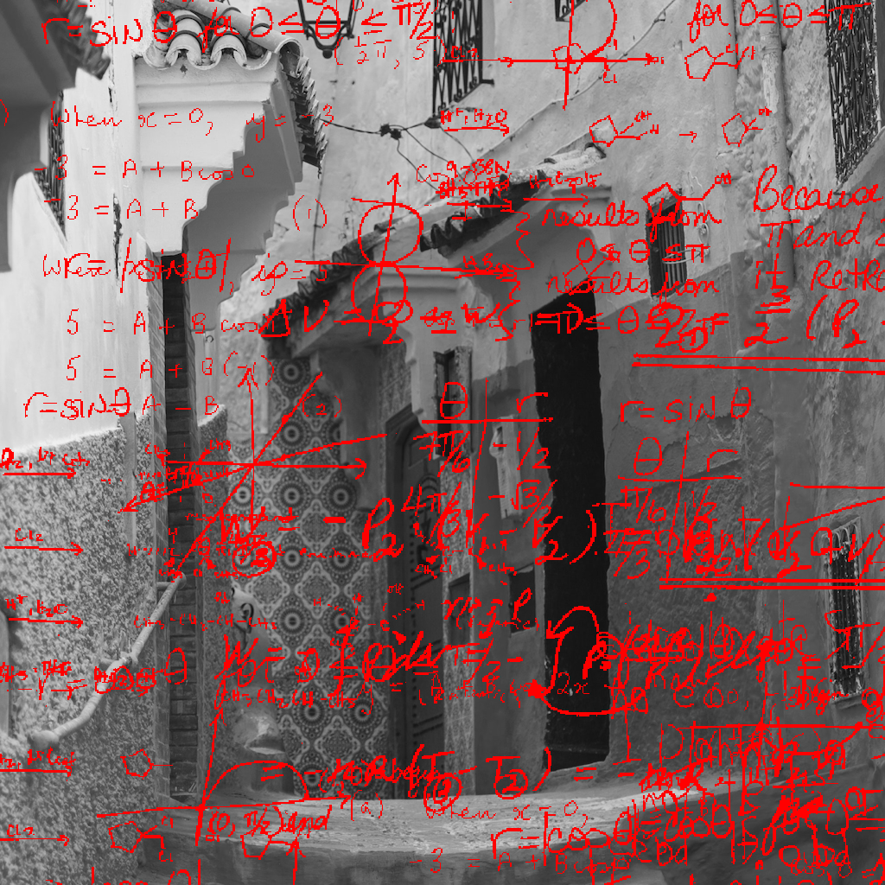
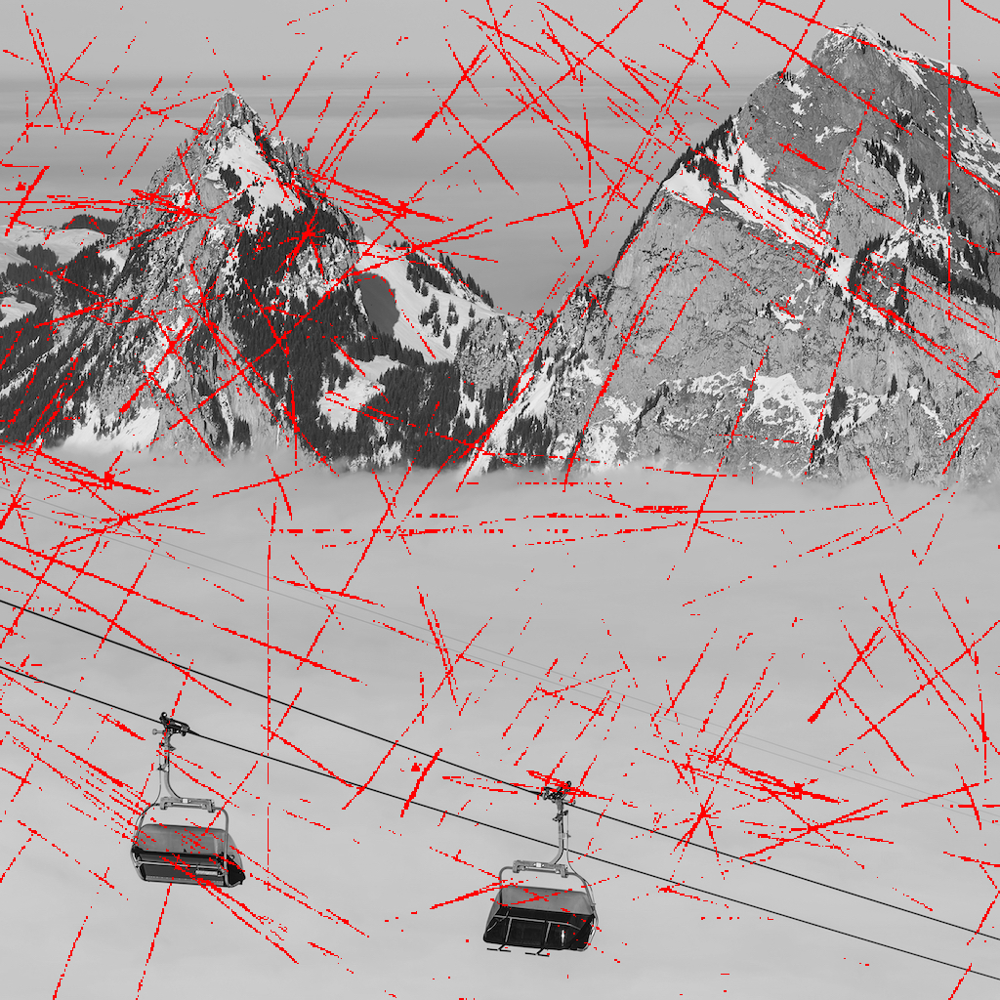
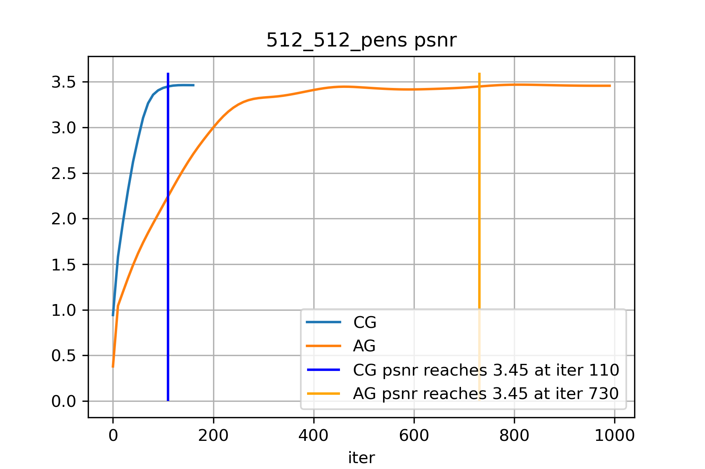
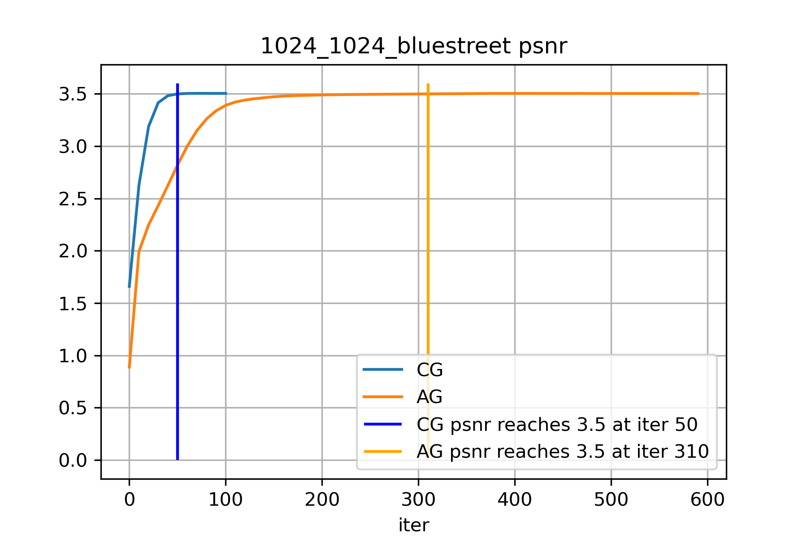
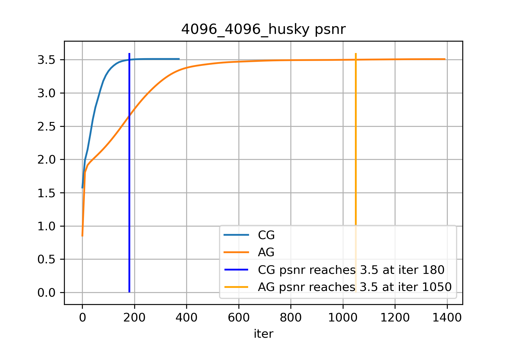

# Assignment 4

## Student Info
- id: 116020237
- mail: 116020237@link.cuhk.edu.cn

## Problem A
- file: [src/mask_painter.rs](src/mask_painter.rs)
- outputs:
  - [problem-a-output-1.png](test/test_outputs/problem-a-output-1.png)
  - [problem-a-output-2.png](test/test_outputs/problem-a-output-2.png)
- run script: [problem_a.sh](problem_a.sh)

### Output Images
<div style="text-align: center">
  
  
</div>

## Problem B
Compute the gradient:
$\nabla f = \frac{1}{2}\nabla_x\lVert{Ax-b}\rVert^2 + \frac{\mu}{2}\nabla_x\lVert{Dx}\rVert^2$,
where
$$
\begin{align*}
\nabla_x\lVert{Ax-b}\rVert^2&=\nabla_x[(Ax-b)^T(Ax-b)]\\
&=\nabla_x[x^TA^TAx-2x^TA^Tb]\\
&=2A^TAx-2A^Tb
\end{align*}
$$
and $\nabla_x\lVert{Dx}\rVert^2=\nabla_x[x^TD^TDx]=2D^TDx$.

Therefore, $\nabla f = 0$ gives $A^TAx-A^Tb+\mu D^TDx=0$,
which simplifies to $(A^TA+\mu D^TD)x=A^Tb$.
Since $\nabla f(x) = 0$ is the necessary condition for $x$ to be an optimal point.

This proves the *only if* side.

The Hessian matrix is a constant for all $x$:
$\nabla^2f=\nabla[\nabla f]=A^TA+\mu D^TD$.
Moreover, by definition, since
$x^T [\nabla^2 f] x = xA^TAx + \mu xD^TDx = \lVert{Ax}\rVert + \mu \lVert{Dx}\rVert \ge 0$,
$\nabla^2f$ is positive semi-definite everywhere.
Thus, $f$ is a convex function, and therefore $\nabla f(x) = 0$
implies $x$ to be a global minimal.

This proves the *if* side.

## Problem C

Simplify the algorithm to make it more efficient.

Let $B=A^TA+\mu D^TD$ and $c = A^T b$.
$$
\begin{align}
y^{k+1}&=x^k+{\beta_k}(x^k-x^{k-1})=(1+\beta_k)x^k-{\beta_k}x^{k-1}\\
\nabla f(y^{k+1})&=By^{k+1}-c\\
x^{k+1}&=y^{k+1}-\alpha\nabla f(y^{k+1})
\end{align}
$$
So the algorithm goes:

```
# init containers
x_old <- x.copy()
x_tmp <- zero(x.shape)
y <- zero(x.shape)

begin loop:

	# x_tmp for memorizing x
	x_tmp.copy(x)

	# x is now y^k+1
	x <- (1 + beta) * x - beta * x_old
	y.copy(x)

  # x is now Df(y^k+1)
	x <- B * x - c
	if (|x| <= tol):
  	return x_tmp
  end if
  
  # x in now x^k+1
  x <- y - alpha * x

	# put x_tmp back
	x_old <- x_tmp

end loop
```


- file: [src/ag_methods.rs](src/ag_method.rs)

## Problem D

The implementation is very optimized.
It uses as little memory allocation as possible.
Within the loop, only one memory allocation is used
for caching the matrix multiplication result of `B * p`.

- file: [src/cg_method.rs](src/cg_method.rs)

## Problem E
- files:
  - matrix generation: [src/opt_utils.rs](src/opt_utils.rs)
  - inpaint runner: [src/inpaint_worker.rs](src/inpaint_worker.rs)
- run script: [problem_e.sh](problem_e.sh)
- script output: [problem_e_output.txt](problem_e_output.txt)

### Analysis
#### Convergence Speed
In our three tests, the convergence of the two algorithms
as shown by the PSNR curves.
To reach the same level of PSNR value, the AG algorithm needs to do
$730/110=6.64$, $310/50=6.2$, and $1050/180=5.89$ which is roughtly
about 6 times as many numbers of iteration as the CG algorithms.

<div style="text-align: center">
  
</div>
<div style="text-align: center">
  
</div>
<div style="text-align: center">
  
</div>

#### Execution Time

The following contain the runtime stats of each algorithms.
For full result please refer to [problem_e_output](problem_e_output.txt).
For each of the three tests, the time for each single iteration are roughly the same:
'CG: 1ms 314us 539ns' vs 'AG: 1ms 303us 333ns',
'CG: 5ms 601us 767ns' vs 'AG: 7ms 254us 559ns',
and for bigger pictures:
'CG: 91ms 232us 69ns' vs 'AG: 88ms 699us 674ns'.

All in all CG shows a much faster convergence speed,
and uses roughly only 1/6 of time to reach simialar result.

##### 512_512_pens
```
++ CG Run Stats ++
-+-------------------+------------------------+-------------------+
 | optimization_time | average_iteration_time | total_time        |
-+-------------------+------------------------+-------------------+
 | 214ms 270us       | 1ms 314us 539ns        | 316ms 237us 916ns |
-+-------------------+------------------------+-------------------+
++ AG Run Stats ++
+----------------------+------------------------+----------------------+
| optimization_time    | average_iteration_time | total_time           |
+----------------------+------------------------+----------------------+
| 2s 729ms 181us 666ns | 1ms 303us 333ns        | 2s 797ms 536us 666ns |
+----------------------+------------------------+----------------------+
```

##### 1024_1024_blue_streets
```
++ CG Run Stats ++
+-------------------+------------------------+-------------------+
| optimization_time | average_iteration_time | total_time        |
+-------------------+------------------------+-------------------+
| 588ms 185us 541ns | 5ms 601us 767ns        | 895ms 697us 708ns |
+-------------------+------------------------+-------------------+
++ AG Run Stats ++
+-----------------------+------------------------+--------------------+
| optimization_time     | average_iteration_time | total_time         |
+-----------------------+------------------------+--------------------+
| 10s 787ms 531us 125ns | 7ms 254us 559ns        | 11s 85ms 6us 375ns |
+-----------------------+------------------------+--------------------+
```

##### 4096_4096_husky
```
++ CG Run Stats ++
+-----------------------+------------------------+-----------------------+
| optimization_time     | average_iteration_time | total_time            |
+-----------------------+------------------------+-----------------------+
| 34s 303ms 258us 416ns | 91ms 232us 69ns        | 39s 221ms 514us 958ns |
+-----------------------+------------------------+-----------------------+
++ AG Run Stats ++
+------------------------+------------------------+-------------------------+
| optimization_time      | average_iteration_time | total_time              |
+------------------------+------------------------+-------------------------+
| 2m 4s 623ms 44us 166ns | 88ms 699us 674ns       | 2m 9s 207ms 445us 500ns |
+------------------------+------------------------+-------------------------+
```
### Output Images
#### CG Algorithms
<div style="text-align: center">
  
  
  
</div>

### AG Algorithms
<div style="text-align: center">
  
  
  
</div>
